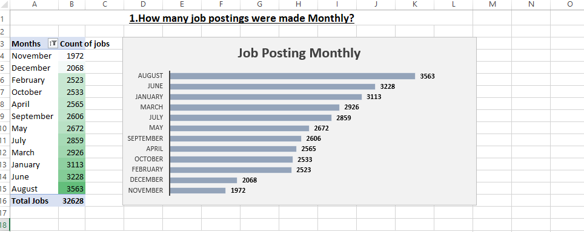

# 💼 Job Data Analysis

### 📊 Overview
This project analyzes **job market trends, salaries, company hiring behavior, and skill demand** using real-world job posting data collected over **12 months**.  
It demonstrates end-to-end data cleaning, transformation, and dashboard creation in **Microsoft Excel 2016**.

The interactive Excel dashboard and PDF report summarize **31 key business questions** related to hiring patterns, salary insights, and skill trends across regions.

---

## 🗂️ Folder Structure
```text
Job Data Analysis/
│
├── Raw Data/
│   ├── 01_Jan_data_jobs.xlsx
│   ├── 02_Feb_data_jobs.xlsx
│   ├── ...
│   └── 12_Dec_data_jobs.xlsx
│
├── Job Data Analysis.xlsx        # Final Excel dashboard with PivotTables & charts
├── Dashboard_preview.pdf         # Exported dashboard report (one-page visual summary)
└── Images/                       # Screenshots of dashboard and visuals
    ├── dashboard_full.png
    ├── top_skills_chart.png
    └── salary_trend_chart.png

```
---

## 🎯 Objectives

- Analyze **job postings** across multiple months to identify hiring and salary trends.
- Explore **skills in demand** across roles, regions, and companies.
- Compare **remote vs on-site** work and its impact on salary.
- Evaluate **degree requirements**, **health insurance benefits**, and **top-paying companies**.
- Present insights through an **interactive Excel dashboard** with slicers and dynamic charts.

---

## 🧮 Key Analytical Questions

### 📅 Job Market & Posting Trends
1. How many job postings were made monthly?  
2. What are the most common job titles?  
3. What is the distribution of jobs by country?  
4. How many jobs allow remote (work-from-home)?  
5. What is the trend of job postings by day?  
6. Which platforms post the most jobs?

### 💰 Salary Insights
7. What is the average salary per role?  
8. What are the top-paying companies?  
9. How does remote work affect average salary?  
10. Are there location-based salary differences?  
11. How does degree requirement affect salary?  
12. What is the distribution of annual salaries?  
13. Which jobs offer health insurance and how do their salaries compare?

### 🏢 Company Insights
14. Which companies posted the most jobs?  
15. What is the average salary per company?  
16. Which companies hire for multiple job titles?  
17. Which companies have the highest remote job ratio?

### 🧠 Skill Demand & Trends
18. What are the most in-demand skills overall?  
19. Which skills are most common for each role?  
20. What is the average salary by skill?  
21. What skill combinations frequently appear together?  
22. Are there skills unique to certain job titles?  
23. How many unique skills exist in total?

### 🌍 Regional Insights
24. Which countries/states have the most job postings?  
25. Which regions pay the highest average salary?  
26. What’s the ratio of local vs remote jobs by region?  
27. Any skills regionally concentrated?

### ⏱️ Time-based Trends
28. How has total job volume changed month-over-month?  
29. How have average salaries evolved over time?  
30. Which skills gained or lost popularity month-over-month?  
31. Which companies were consistently hiring?

---

## 📊 Dashboard Highlights

| Insight | Visual Example |
|----------|----------------|
| **Monthly Job Postings** |  |

📄 View the full dashboard:  
➡️ [**Job Data Analysis.pdf**](Dashboard_preview.pdf)

---

## ⚙️ Tools & Techniques

| Tool | Purpose |
|------|----------|
| **Microsoft Excel 2016** | Main analysis & dashboard |
| **Power Query** | Data cleaning and merging monthly files |
| **PivotTables & PivotCharts** | Aggregation and visualization |
| **Slicers** | Interactive filtering |
| **Conditional Formatting** | Highlighting key insights |
| **PDF Export** | Final report format for sharing |

---

## 💡 Insights Summary

- **Data roles dominate** monthly postings — especially Data Analyst and Data Scientist positions.  
- **Remote jobs** account for ~18.24% of postings, with competitive salaries comparable to on-site roles.  
- **SQL, Python and Tableau** remain top skills across most roles.  
- **Corporate employers** consistently post more jobs but offer slightly lower pay on average. 

---

## 🧑‍💻 Author

**Utkarsh Naik**  
Tech Professional | Data Analytics Enthusiast  
- Contact: utkarsh.un@gmail.com

