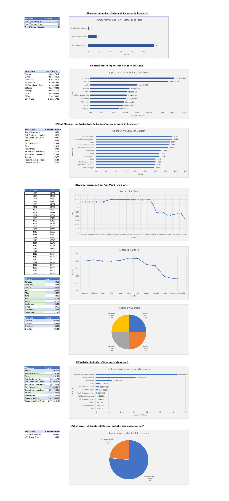
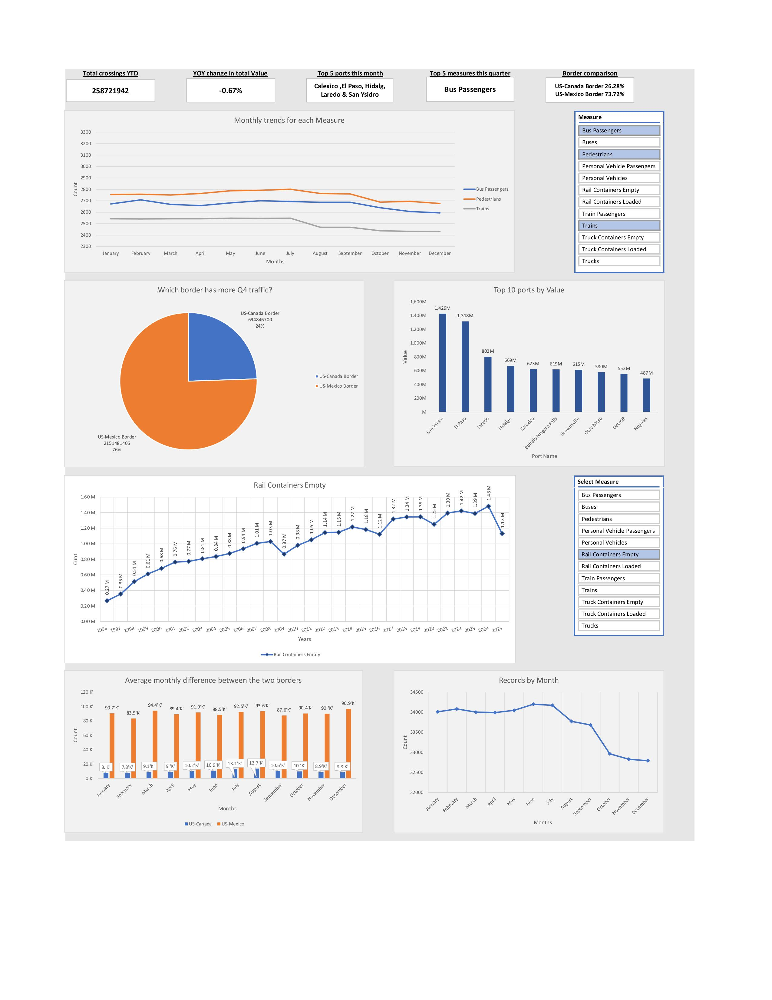

# 🇺🇸 Border Crossing Entry Data — Excel Analysis Project

**Author:** Utkarsh Naik  
**Tool Used:** Microsoft Excel (Power Query, PivotTables, Charts, Dashboard)  
**Dataset Source:** [U.S. Border Crossing Entry Data (Data.gov)](https://catalog.data.gov/dataset/border-crossing-entry-data-683ae)

---

## 📘 Project Overview
This project analyzes **404,544+ official U.S. government records** of border crossing activity across the **U.S–Canada** and **U.S–Mexico** borders.  
The analysis includes:

- Port-wise traffic  
- Border comparisons  
- Measure-level distribution  
- Seasonality and quarterly patterns  
- YOY changes and long-term trends  
- Advanced analytics & KPI dashboard  

The goal is to understand **cross-border movement trends**, identify the busiest ports, compare borders, detect seasonal spikes, and evaluate YOY performance.

---

## 📂 Folder Structure
```
Border Crossing Entry Data USA/
│
├── Border_Crossing_Entry_Data_ANALYSIS.xlsx
│
├── Readme.md
│
├── Result/
│ ├── Exploratory_Analysis.jpg
│ ├── Time_Based_Analysis.jpg
│ ├── Border_Comparison.jpg
│ ├── Port_Level_Analysis.jpg
│ ├── Measure_Level_Analysis.jpg
│ ├── Advance_Analytics.jpg
│ ├── Dashboard.jpg
│
│ └── PDFs/
│ ├── Exploratory_Analysis.pdf
│ ├── Time_Based_Analysis.pdf
│ ├── Border_Comparison.pdf
│ ├── Port_Level_Analysis.pdf
│ ├── Measure_Level_Analysis.pdf
│ ├── Advance_Analytics.pdf
│ └── Dashboard.pdf
```

---


## 📊 Key Insights

### 1️⃣ **Exploratory Findings**

- **120+ ports**, **15 states**, **2 borders**  
- Records span multiple decades  
- Personal Vehicles & Passengers dominate total crossings  
- U.S–Mexico border = **~74% of total traffic**  
- Monthly & quarterly record distribution remains remarkably consistent  

---

### 2️⃣ **Time-Based Trends**

- Highest activity occurs **May–August**  
- Q3 consistently records the **highest crossings**  
- YOY analysis (1996–2025):
  - Peak around **2000–2001**
  - Decline after **2019**
  - Slow recovery post-pandemic  

---

### 3️⃣ **Border Comparison**

- U.S–Mexico border handles **significantly higher traffic**  
- Higher crossings for Trucks, Buses, Pedestrians, Trains  
- Monthly average difference strongly favors Mexico border  
- Mexico border consistently dominates **Q4 traffic**  

---

### 4️⃣ **Port-Level Insights**

- Top ports: **Brownsville, Buffalo-Niagara Falls, Calexico, Otay Mesa, Hidalgo, Laredo, El Paso, San Ysidro**  
- **San Ysidro** has highest pedestrian crossings & highest traffic volatility  
- Laredo & Detroit dominate **truck & container traffic**  

---

### 5️⃣ **Measure-Level Insights**

- Biggest contributors:
  - Personal Vehicle Passengers  
  - Personal Vehicles  
  - Train Passengers  
- Truck Containers & Trucks show strong **Q3 seasonal spikes**  
- Top ports differ drastically for each measure  

---

### 6️⃣ **Advanced Analytics**

- Sudden spikes and drops identified across quarters  
- Q3 contributes the most to annual totals  
- Variance analysis highlights unstable ports  
- YOY performance charts show long-term decline after 2019  

---

### 7️⃣ **Dashboard KPIs**

- Total crossings YTD  
- YOY % change  
- Top 5 ports (current month)  
- Top 5 measures (current quarter)  
- Border contribution:  
  - U.S–Canada vs U.S–Mexico  
- Monthly & yearly trends  
- Top 10 ports by Value  
- Q4 border comparison  
- Rail container trends  

---

## 🚀 Outcome
This Excel project delivers:

- A **complete analytical breakdown** of U.S. border crossing patterns  
- A professional, interactive **dashboard**  
- Multi-level analysis: border, port, measure, time, YOY  
- Insights useful for policymakers, logistics, transportation research, and analytics portfolios  

---

## 🔗 References
- Official Dataset: https://catalog.data.gov/dataset/border-crossing-entry-data-683ae  
- Tool Used: Microsoft Excel (2016)

---

**📌 Author:** Utkarsh Naik  
**🎯 Project Type:** Exploratory + Advanced Analytics + Dashboard  

